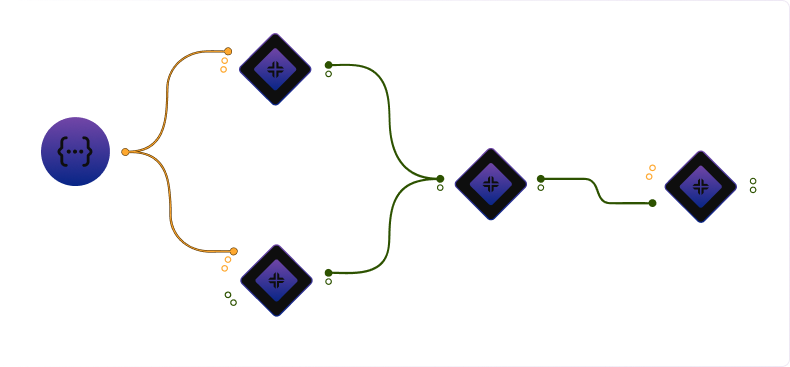

# MindExec – Visual Web Vulnerability Workflow Builder

MindExec is a React application that provides a visual, graph-based editor for designing security tool workflows. The core value proposition is replacing manual, error-prone CLI command composition with a structured, visual workflow model that resolves into deterministic, executable command-line instructions.



---

## What is MindExec?

MindExec enables security engineers, penetration testers, and bug bounty hunters to:

- **Visually assemble workflows** as node graphs, where nodes represent tools, scripts, and data inputs
- **Model data flow** through edges that connect outputs to inputs with type validation
- **Generate executable CLI commands** automatically from the graph structure

The system is not a generic React Flow demonstration. It implements domain-specific logic for:
- Tool metadata management (base commands, flags, input/output types)
- Graph-based command generation that resolves node connections into CLI strings
- Type-safe edge validation ensuring compatible data flow between nodes

Users build workflows by dragging tools and inputs onto a canvas, connecting them via edges, and configuring parameters. The editor generates the final command-line instructions that can be executed in controlled environments.

---

## Editor Design

The editor uses a three-panel layout optimized for working with security tool workflows:

### Three-Panel Layout

- **Left Panel (Library)**: Tool and input node library with searchable categories (Scripts, Splitters, Tools). Supports drag-and-drop onto the canvas.
- **Center Panel (Canvas)**: React Flow-based graph canvas where users assemble workflows. Nodes can be positioned, connected, and selected.
- **Right Panel (Configuration)**: Selection-driven configuration panel that adapts to the active node type:
  - For tool nodes: displays configurable inputs with toggle switches
  - For input nodes: provides value editors (string textarea, boolean toggle, file/folder selectors)

### Collapsible Panels

Both left and right panels can be collapsed to maximize canvas real estate. When collapsed, floating toggle buttons appear on the canvas edges to restore panels. This design accommodates workflows with many nodes while maintaining access to configuration options.

### Real-Time Command Preview

The editor includes a command preview panel that displays the generated CLI command for the selected node. This preview updates in real-time as users:
- Modify node connections
- Configure input values
- Toggle input activation states

The command generation engine (`src/lib/commandEngine.js`) traverses the graph, resolves input values from connected nodes, and composes the final command string with appropriate flags and arguments.

---

## Key Technical Concepts

### Graph-Based State Modeling

The application models workflows as a graph structure:
- **Nodes**: Represent tools, scripts, or input sources. Each node holds metadata including base command, input/output definitions, and current configuration state.
- **Edges**: Represent data flow connections. Edges connect source outputs to target inputs with type validation.
- **Selection State**: Tracks the currently selected node/edge to drive the configuration panel updates.
<!-- - **Lifecycle Flags**: Manages editor modes (builder vs. runner) and workflow execution state. -->

State is managed globally via React Context (`AppContext`, `AppProvider`) to ensure consistent updates across the three-panel layout.

### Command Generation Engine

The command generation system (`src/lib/commandEngine.js`) implements deterministic CLI composition:

1. **Input Resolution**: For each node, resolves input values by traversing incoming edges to source nodes
2. **Flag Composition**: Iterates through active inputs and appends appropriate flags based on input type (boolean flags vs. value flags)
3. **Command Assembly**: Combines base command with resolved flags into a final executable string

The engine handles:
- Type validation between connected nodes
- Default value fallbacks for unconnected inputs
- Boolean flag handling (presence vs. absence)
- Value flag formatting (flag + value pairs)

### Global State Management

Workflow state (nodes, edges, selection, panel visibility) is centralized in `AppProvider` to ensure:
- Predictable updates when nodes are added, removed, or modified
- Consistent rendering across all editor components
- Efficient re-renders through React Flow's built-in state hooks (`useNodesState`, `useEdgesState`)

---

## Tech Stack

- **React 18** - UI framework
- **Vite** - Build tool and dev server
- **React Flow** (`reactflow`) - Graph canvas and node rendering
- **Supabase** - Authentication and user data persistence
- **Tailwind CSS** - Styling with custom theme
- **Framer Motion** - Animations and micro-interactions
- **React Router DOM** - Client-side routing
- **React Hook Form** - Form validation
- **React Hot Toast** - User notifications

<!-- ---

## Execution Disclaimer

**Important**: The workflow execution system is currently simulated. The editor focuses on:

- Visual workflow design and modeling
- Command generation and preview
- Workflow persistence and management

Execution of generated commands is intentionally left to external, controlled environments. The run simulation in `src/hooks/useWorkflow.js` demonstrates the intended execution flow but does not execute actual security scans. -->

---

## Getting Started

### Prerequisites

- **Node.js** (LTS recommended; e.g. `>= 18.x`)
- **pnpm** or **npm**

### Installation

1. Clone the repository:
```bash
git clone https://github.com/Mohammedatef1/MindExec.git
cd MindExec
```

2. Install dependencies:
```bash
pnpm install
# or
npm install
```

3. Configure environment variables:

Create a `.env` file at the project root:
```bash
VITE_SUPABASE_URL=<your-supabase-project-url>
VITE_SUPABASE_KEY=<your-supabase-anon-key>
```

4. Run the development server:
```bash
pnpm dev
# or
npm run dev
```

The application will be available at `http://localhost:5173/` (Vite's default port).

### Available Scripts

- **`pnpm dev`** / **`npm run dev`** - Start development server with HMR
- **`pnpm build`** / **`npm run build`** - Create production build
- **`pnpm preview`** / **`npm run preview`** - Preview production build locally
- **`pnpm lint`** / **`npm run lint`** - Run ESLint

---

## Project Structure

```
MindExec/
├─ public/               # Static assets
├─ src/
│  ├─ App.jsx            # Root app & routing
│  ├─ main.jsx           # ReactDOM entry point
│  ├─ client.js          # Supabase client configuration
│  ├─ AppContext.jsx     # Global context definition
│  ├─ AppProvider.jsx    # Context provider & state management
│  ├─ components/
│  │  ├─ Home/           # Landing page components
│  │  ├─ layout/         # Editor layout (Nav, LeftFrame, MindMap, RightFrame, Workflow)
│  │  ├─ icons/          # SVG icon components
│  │  └─ ui/             # Reusable UI (nodes, buttons, modals)
│  ├─ pages/
│  │  ├─ Home.jsx        # Public landing page
│  │  ├─ Login.jsx       # Authentication: login
│  │  ├─ Register.jsx    # Authentication: signup
│  │  ├─ Dashboard.jsx   # Authenticated dashboard (workflow list)
│  │  ├─ Editor.jsx      # Workflow editor entry point
│  │  ├─ ProtectedRoute.jsx
│  │  └─ ProtectedSignRoute.jsx
│  ├─ hooks/
│  │  ├─ useActiveUser.js    # Current user via Supabase
│  │  ├─ useWorkflow.js      # Workflow execution (simulated)
│  │  └─ useCommands.js      # Command generation utilities
│  ├─ lib/
│  │  ├─ commandEngine.js    # Core command generation logic
│  │  └─ utils.js            # Utility helpers
│  ├─ assets/
│  │  └─ Data.js              # Tool registry and metadata
│  └─ index.css              # Global styles + Tailwind layers
├─ tailwind.config.js    # Tailwind configuration
├─ vite.config.js        # Vite configuration
└─ package.json
```

---

## Environment Configuration

MindExec requires Supabase for authentication and workflow persistence. Configure the following in `.env`:

```bash
VITE_SUPABASE_URL=<your-supabase-project-url>
VITE_SUPABASE_KEY=<your-supabase-anon-key>
```

**Notes:**
- Vite exposes variables prefixed with `VITE_` to the client
- For production deployments, configure the same variables in your platform's environment settings

---

## Security Notes

- **Execution Boundary**: MindExec generates commands but does not execute them. Always run generated commands in isolated, authorized environments under your control.

---

## Contributing

Contributions are welcome. When contributing:

1. Open an issue describing the enhancement or bug
2. Create a feature branch from `main`
3. Add tests where reasonable
4. Run `pnpm lint` and fix any issues
5. Open a pull request for review
